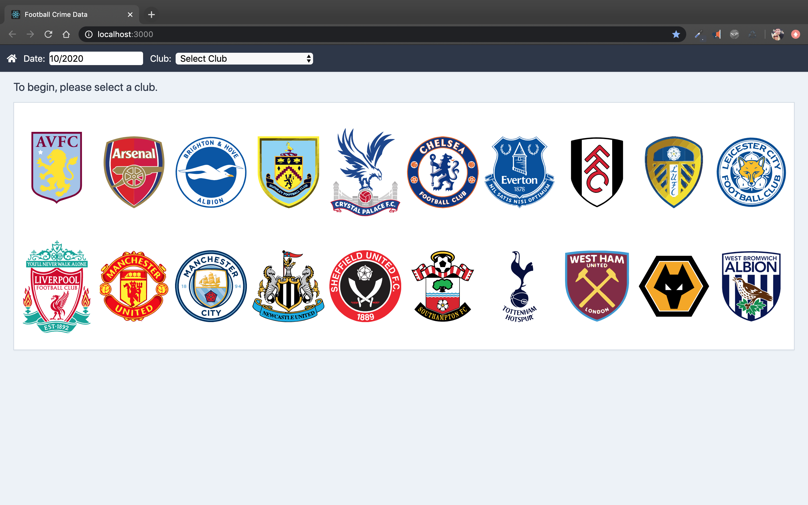
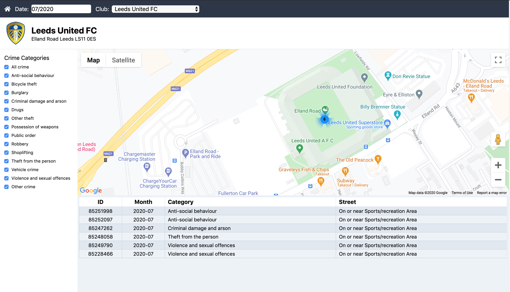
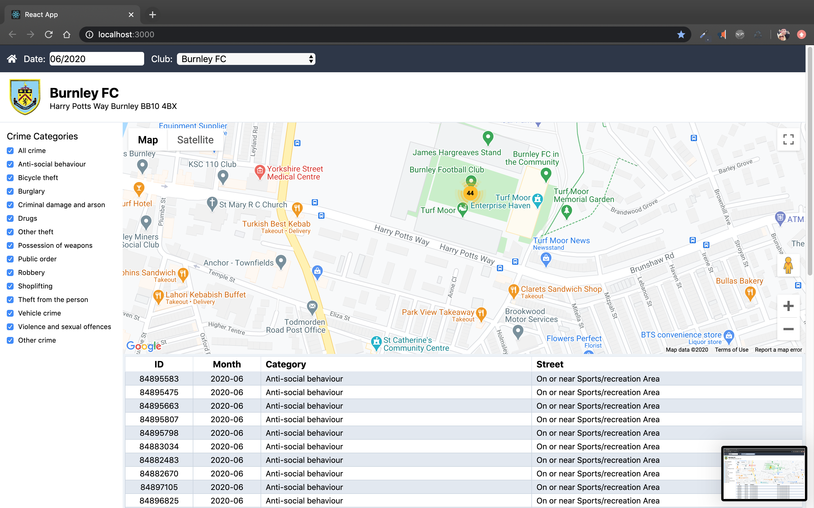

# Premier League Crime Visualiser

This app allows you to visualise crimes that occurred at Premier League grounds for a given month.

## Demo
A working demo of the application can be found [here](https://glowing-spork-app.herokuapp.com/).

## Instructions

To build the app locally follow these steps:

1. Clone the repository.
2. `brew install yarn` if you don't have yarn.
3. `yarn install` to install node dependencies.
4. `yarn build-css` to generate the stylesheet.
5. Rename `.env.sample` to `.env.local`.
6. Obtain a `football-data.org` API token from [here](https://www.football-data.org/client/register).
7. Paste API token into `.env.local` and save.
8. The GoogleMaps API key is optional.
9. `yarn start` to start the application.
10. `yarn test` to run the unit tests.

## Issues & Observations

1. Some of the teams had incorrect postcodes causing the lookup to respond with `404`. I reported the following issues to the maintainer (edit: these have now been fixed 👏)
   - Liverpool and Spurs's postcodes contain the letter O instead of a zero.
   - West Ham moved grounds in 2016.
2. The instructions mention sorting the crimes by year and month but the `crimes-by-location` API only returns a single month of crimes with no additional date information in the response.
3. `crimes-by-location` throws a `500` error when querying for the current month, I've set the default to the previous month.

# Images

